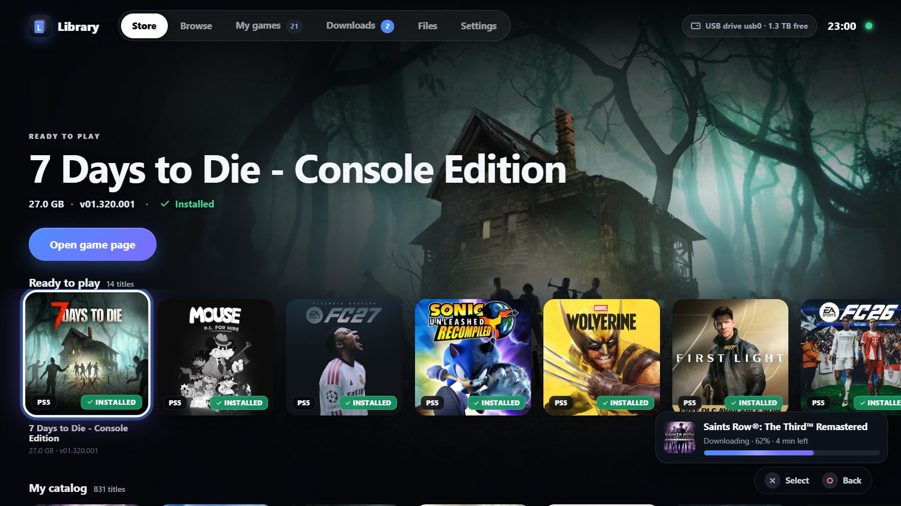
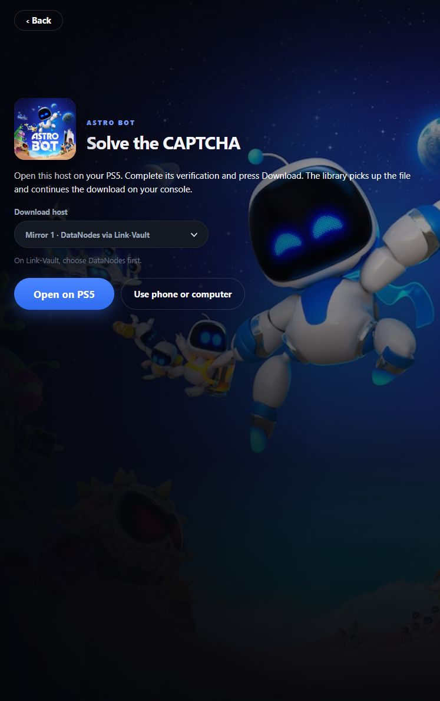
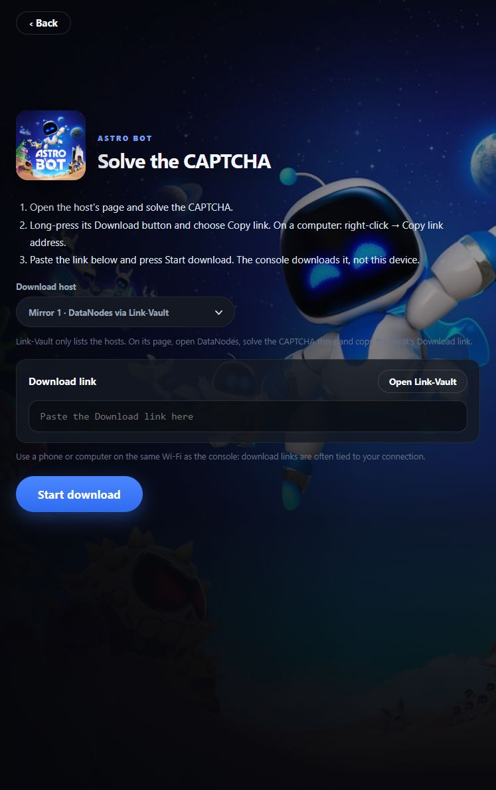
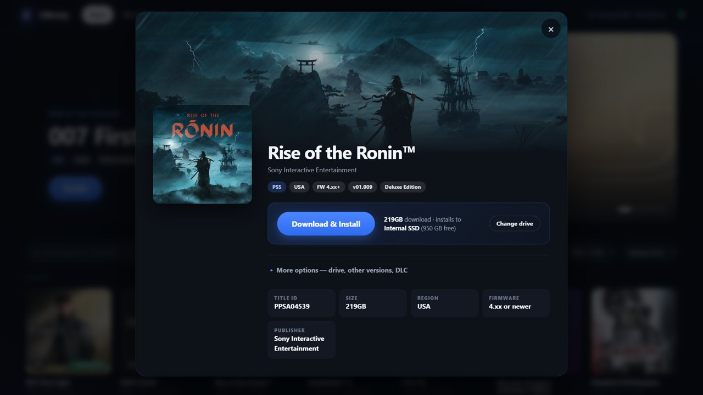
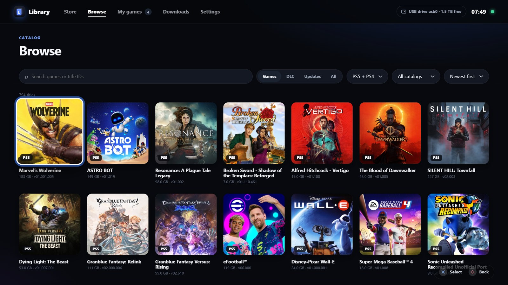
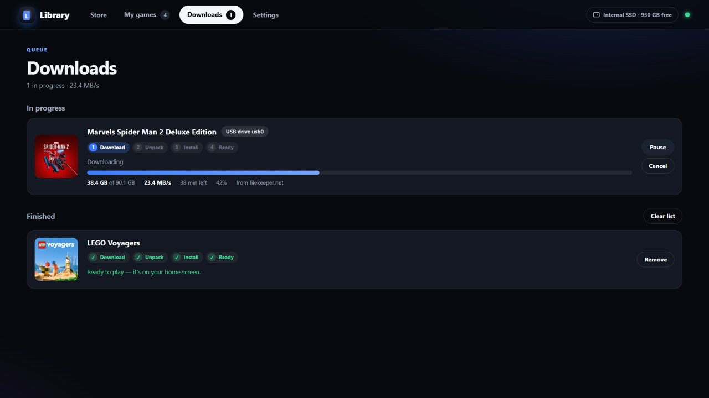
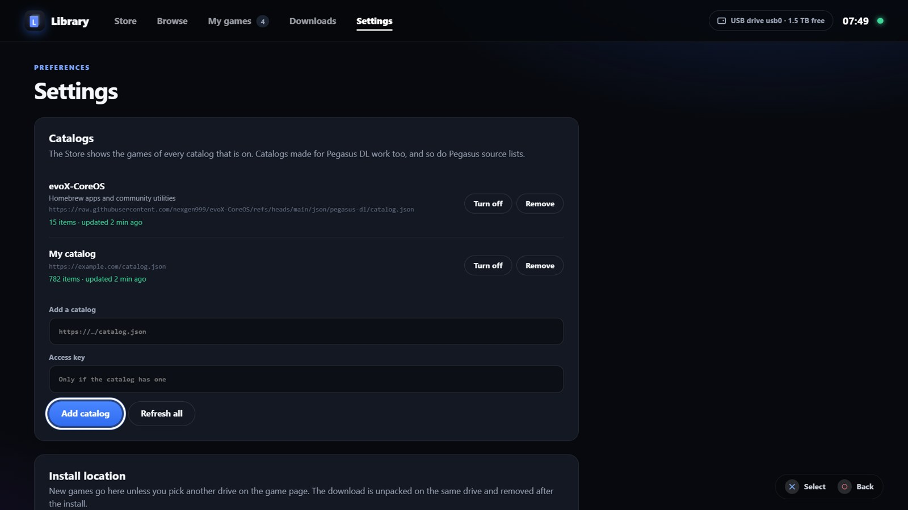

<p align="center"></p>
<h1 align="center">PS5 Library</h1>
<p align="center"><b>A game library for jailbroken PS5.</b><br>Pick a game, press <b>Download&nbsp;&amp;&nbsp;Install</b>, play it from your home screen.</p>

<p align="center"></p>

## Features

- **One payload.** `ps5-library.elf` adds a **PS5 Library** tile to your home screen. The tile opens the library in the PS5 browser.
- **Feels like the console.** The game you select fills the screen, rows of games sit underneath, and every game has a full-screen page.
- **One button.** The console downloads, unpacks and installs the game. When it's done, the game is on your home screen.
- **Internal SSD or USB.** Pick a drive per game, or set a default. Games in exFAT/FFPKG format run from that drive through ShadowMountPlus. PKG games go through the system installer.
- **Downloads resume** after a pause, a dropped connection, a failed attempt or a console restart. Partial files are cleaned up after the install.
- **Made for the controller.** Move with the D-pad, select with Cross, go back with Circle.
- **Several catalogs at once.** Every catalog gets its own row in the Store, games first and homebrew after them. Catalogs made for Pegasus DL work too. A homebrew catalog is on from the start.
- **Covers and details:** size, region and minimum firmware for every game.
- **Any browser.** Open `http://<ps5-ip>:9999` on your phone or PC to queue games from the couch (19999 if [another payload uses 9999](#troubleshooting)).
- **Browser downloads.** Open a host on your PS5, complete its verification and press Download. The library captures a usable file link and adds it to Downloads. A phone or computer can also supply a download link.
- **Optional accounts.** A premium key or a TorBox account can download from supported hosts directly.

## Downloads that need a browser

Choose **Solve CAPTCHA → Open on PS5**, complete the host's check yourself, then press its **Download** button. For multipart downloads, the library opens the next part in turn and returns to Downloads after collecting the links. You can cancel capture from the library.



If a site does not work in the PS5 browser, choose **Use phone or computer**. Use the same Wi-Fi as the console, complete verification there, and copy the file's download link into the library.



Browser capture is tested on firmware 13.60 with controlled multipart files. Compatibility varies by host; links requiring browser cookies or a different browser may not work. CAPTCHA verification is manual. Link-Vault currently opens its provider selection page; automatic Link-Vault link and filename parsing is deferred.

## Requirements

- A jailbroken PS5 with an ELF loader. Tested on firmware 13.60.
- Free space: a game packed as an archive (7z, rar, zip) needs about **twice its size** free while it installs, because the archive and the unpacked game are on the drive together. The archive is deleted after the install. The library checks the space before it downloads.
- [kstuff](https://github.com/EchoStretch/kstuff-lite)
- [ShadowMountPlus](https://github.com/drakmor/shadowMountPlus)

## Install

1. Download `ps5-library.elf` from [Releases](../../releases/latest).
2. Load it with your ELF loader (port 9021) or your payload manager. Add it to **autoload**: the home screen tile only works while the payload is running.
3. A notification says **PS5 Library added to the home screen**. Open the tile.
4. The homebrew catalog [evoX-CoreOS](#the-default-catalog) is already on. Add more in **Settings → Catalogs**, see [Catalogs](#catalogs) below.

## Catalogs

PS5 Library does not publicly include, host or link to any games. The Store shows the games from the catalogs you add. A catalog is a JSON file at a web address.

### Add a catalog

> **Tip:** typing a long address with the controller is slow. Open `http://<ps5-ip>:9999` on your phone or PC and paste the address there.

1. Open **Settings → Catalogs**.
2. **Add a catalog:** the full address of the JSON file. It must start with `http://` or `https://`.
3. **Access key:** fill it in only if the catalog's owner gave you a key. Otherwise leave it empty. The key is sent as `Authorization: Bearer <key>`.
4. Press **Add catalog**. The library reads the catalog straight away and its games show up in the Store.

Good to know:
- You can add up to 30 catalogs. The Store shows the games of every catalog that is on. When two catalogs have the same game, its page lists both.
- **Turn off** hides a catalog's games, **Remove** deletes the catalog from the list.
- The library checks catalogs by itself: catalogs with a key every minute, the others every 10 minutes. **Refresh all** checks them now. If a catalog goes offline, you keep its last copy.
- **Browse** can show the games of one catalog only.

### Catalogs on GitHub

Use the **Raw** address. Open the file on GitHub, press **Raw** and copy the address from the browser. The normal file page is a web page, not the JSON file.

| ✗ Doesn't work | ✓ Works |
| --- | --- |
| `https://github.com/user/repo/blob/main/catalog.json` | `https://raw.githubusercontent.com/user/repo/main/catalog.json` |

### Pegasus DL catalogs

Catalogs made for [Pegasus DL](https://github.com/pegasus-ps5/pegasus-dl) work as they are: add the catalog's address like any other. Both Pegasus package shapes are read (`downloadLinks`, or `url` with `filename`), and every link of a package becomes a download mirror.

A Pegasus **source list** (a file with a `"sources": [...]` list) has no games in it, it names other catalogs. Adding a source list adds every catalog it names, turned on or off as the list says.

### The default catalog

[evoX-CoreOS](https://github.com/nexgen999/evoX-CoreOS) by nexgen999 is on from the start: homebrew apps and community utilities. Turn it off or remove it in **Settings → Catalogs**; a removed catalog does not come back.

### Make your own catalog

The smallest catalog has one entry with one file:

```json
{
  "entries": [
    {
      "title": "My Homebrew App",
      "files": [{"url": "https://example.com/my-app.pkg"}]
    }
  ]
}
```

Put the file anywhere that serves files over HTTP(S):
- **GitHub:** add `catalog.json` to a repository or a gist, then connect its Raw address.
- **Your PC:** in the folder with `catalog.json`, run `python -m http.server 8000` and connect `http://<pc-ip>:8000/catalog.json`.

A complete entry, with a second mirror:

```json
{
  "entries": [
    {
      "id": "my-game-exfat",
      "title": "Game name (v1.02)",
      "title_id": "PPSA01234",
      "kind": "game",
      "platform": "ps5",
      "format": "exfat",
      "size": "52GB",
      "region": "EUR",
      "firmware": "4.xx",
      "files": [{"url": "https://mirror-one.example/PPSA01234.7z", "name": "PPSA01234.7z"}],
      "source_sets": [
        {"host": "mirror-one.example", "files": [{"url": "https://mirror-one.example/PPSA01234.7z", "name": "PPSA01234.7z"}]},
        {"host": "mirror-two.example", "files": [{"url": "https://mirror-two.example/PPSA01234.7z", "name": "PPSA01234.7z"}]}
      ]
    }
  ]
}
```

| Field | | What it does |
| --- | --- | --- |
| `entries` | **required** | The list of games. It must contain at least one entry. |
| `files` | **required** | The files to download: `{"url": "...", "name": "..."}`. `name` is optional; without it the name comes from the URL. Several files make one download, for example the parts of a split archive (`.7z.001`, `.7z.002`). |
| `title` | recommended | The name in the Store. Without it the first file name is used. A version in brackets, like `(v1.02)`, is shown as the version. |
| `title_id` | recommended | `PPSA01234` or `CUSA01234`. Brings the cover and background art, groups a game with its DLC and updates, marks it **Ready to play** once installed, and checks that the download is the right game. |
| `kind` | | `game` (default), `dlc` or `update`. |
| `platform` | | `ps5` (default) or `ps4`. Used for the badge and the platform filter. |
| `format` | | `exfat`, `ffpkg`, `ffpfs`, `ffpfsc`, `fpkg` or `pkg`. Shown on the game page. When a game is listed in several formats, exFAT is offered first. The installer finds the real type by itself. |
| `size` | | Download size, like `"52GB"` or `"700 MB"`. Used for **Quick downloads** and for the free space warning. |
| `region`, `firmware`, `version` | | Shown on the game page. `firmware` is the minimum firmware, like `"4.xx"`. |
| `description` | | A few lines shown on the game page. |
| `cover` | | Address of a cover image, used when the PlayStation Store has none (homebrew). |
| `password` | | The archive's password. |
| `source_sets` | | Alternative mirrors: `[{"host": "...", "files": [...]}]`. They are tried in order, and when one fails the next one is used. Put the first mirror's files in `files` too. `host` tells the library which mirrors need a CAPTCHA or an account. |
| `id` | | Your own ID for the entry, unique within the catalog. |

What a download can be:
- A `.pkg`, an exFAT/FFPKG/FFPFS image, or an archive with one of them inside (`.7z`, `.zip`, `.rar`, `.tar`).
- Direct download links work best. Pages of some file hosts work too. For a CAPTCHA, use **Solve CAPTCHA**, or configure a supported account in **Settings → Download accounts**.

## Screenshots

| Game page | Browse |
| --- | --- |
|  |  |
| **Downloads** | **Settings → Catalogs** |
|  |  |

## Troubleshooting

- **The tile opens an empty page.** The payload isn't running. Load it again, or add it to autoload.
- **Another payload uses port 9999.** PS5 Library moves to port **19999** (then 29999) and says so in a notification. It stays on that port on later launches, and the home screen tile follows it. On your phone or PC, open `http://<ps5-ip>:19999`. To pick the port yourself, set `"port"` in `/data/ps5-library/config.json`.
- **"No catalog answered at that address".** Open the address in a browser on your PC. If the browser can't open it either, the catalog is offline or the address is wrong. If the catalog has a key, check the key.
- **"Not enough free space".** The message says how much the game needs. Free up space, or pick another drive on the game page (**Change drive**).
- **"That address returns a web page, not a catalog".** Use the direct file address. On GitHub, use the [Raw](#catalogs-on-github) one.
- **"ShadowMountPlus is not running".** Start ShadowMountPlus, for example through your autoloader.
- **A game shows "Needs a CAPTCHA".** Choose **Solve CAPTCHA → Open on PS5**, or add a supported TorBox account or premium key in **Settings → Download accounts**.

## Credits

Made by **deox**.

Shout-outs:
- **Pippo26442999**
- **[ps5upload](https://github.com/phantomptr/ps5upload)** by phantomptr. PS5 Library's package installer is built on it.
- **[Pegasus DL](https://github.com/pegasus-ps5/pegasus-dl)**. Its catalogs work in PS5 Library too.
- [evoX-CoreOS](https://github.com/nexgen999/evoX-CoreOS) by nexgen999, the default homebrew catalog
- [ShadowMountPlus](https://github.com/drakmor/shadowMountPlus) by drakmor
- [kstuff](https://github.com/EchoStretch/kstuff-lite)
- [ps5-payload-sdk](https://github.com/ps5-payload-dev/sdk) by John Törnblom
- [cpp-httplib](https://github.com/yhirose/cpp-httplib), [nlohmann/json](https://github.com/nlohmann/json), curl, libarchive, OpenSSL

## Disclaimer

PS5 Library is not affiliated with Sony Interactive Entertainment. PS5 Library is a downloader and local file-management tool. It does not include package catalogs, provide package links, bypass accounts, spoof PSN, bypass anti-cheat, or unlock content.
Use it only with content you own or have permission to download.

## License

GPL-3.0-or-later, see [LICENSE](LICENSE). The source code will be published in this repository.
